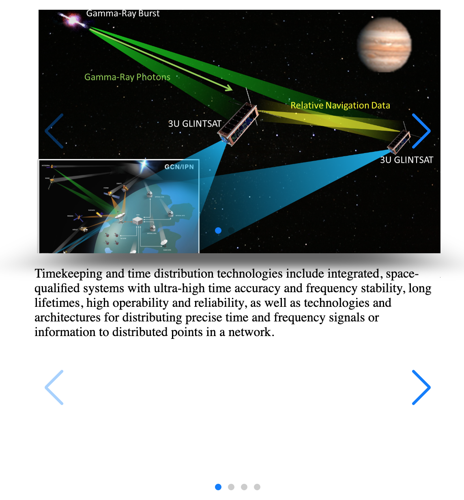
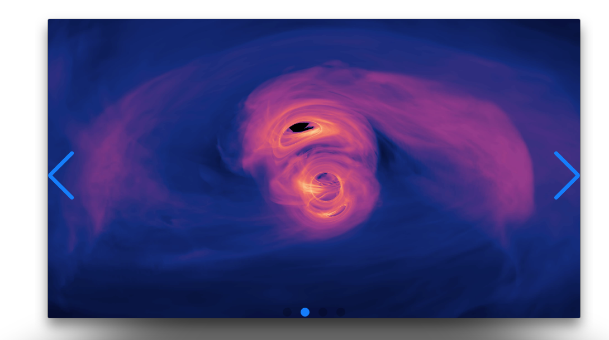
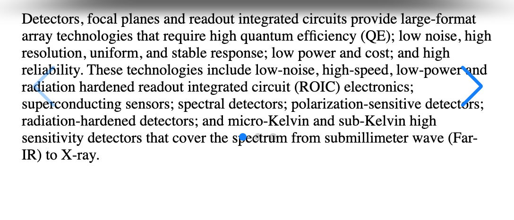
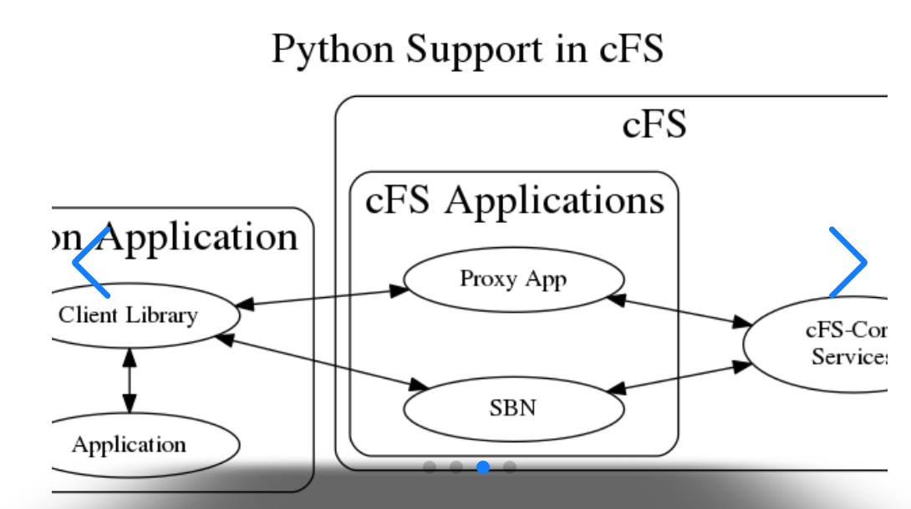

## NASA Tech Viewer Cubes

View NASA Project Tech

## What the app is for

System which allows one to view NASAs coolest research projects using a double cube slider viewing system. Which I call a double helix 😎

The API is limited in its search capability and fairly inconsistent in its data content, so this system bravely attempts to simplify the viewing process, so that it's...interesting (vs a wall of nerd text 🤓).

The system favors images over text, to avoid projects not deemed worthy of an image (likely not that interesting).

## What is NASA Techport API?

NASA's Technology Portfolio Management System (TechPort) is a single, resource for locating detailed information about NASA-funded technologies.

Those technologies cover a broad range of areas, such as propulsion, nanotechnology, robotics, and human health. This includes descriptions of technologies, images, and locations where work is being performed.

Note, the NASA API has a limited search mechanism, relying on specified keywords only. Hence the selection drop down which categorises the data in usable search terms that might interest the viewer.

## JSON

There are many examples of search requests and responses based on various data in the JSON folders. These are for testing purposes, and to research viable search mechanisms.

These folders should also contain. This system currently has only a middle tier, no back-end although this is likely to change. It's a question of speed/viable interface vs fully up to date info (which may not be required, as the system is to give an extensive flavour vs a fully comprehensive archive). Usability vs completeness.

## Technical details

This is a full stack app using:

- React JS / ES7 / Webpack
- React Hooks
- React State
- SCSS / CSS
- SliderJS component
- NASA Techport API

- TODO: Run app, document your steps
- TODO: Include Techport API links (or just the pertinent info) https://techport.nasa.gov/help/articles/api
  TODO: Create a future design section, use your full Stack Design.md as source.

## Main app components

Main:

Image Slider Cube:

Details Cube Slider (with text):

Details Cube (with extra detail image):

detail-cube-image-ntv.png

## Usage

For the app to run you'll need a NASA Open API key. This can be requested here
https://api.nasa.gov/

Note that there are sensible but not exhaustive API rate limits in place. In the body of the response contains information on how many requests have been made per hour, and how many are left.

# To Run app

npm run start

## API specification USED detail

Full details of the Techport API specification are here:
https://techport.nasa.gov/help/articles/api

Most details needed are at the project level as follows:

- projectId - integer($int64)
  Unique identifier for the project.

- primaryImage - derived from the libraryItems group, if available

- benefits - string
  Describes the benefits offered to NASA funded and planned missions, unfunded or planned missions, commercial space industry, and to the nation.

primaryTaxonomyNodes - such as benefits and example technologies. If this doesn't exist, they're asleep at the wheel and the project's not worth getting

libraryItems e.g. Images, PDFs. We use images here, if available
libItem.contentType.code e.g. "IMAGE"

project.statusDescription
project.website
primaryTaxonomyNodes[0].exampleTechnologies
primaryTaxonomyNodes[0].definition

Note: The API was changed in mid 2021, and I'm not sure the docs are fully reflective of that as of yet!
